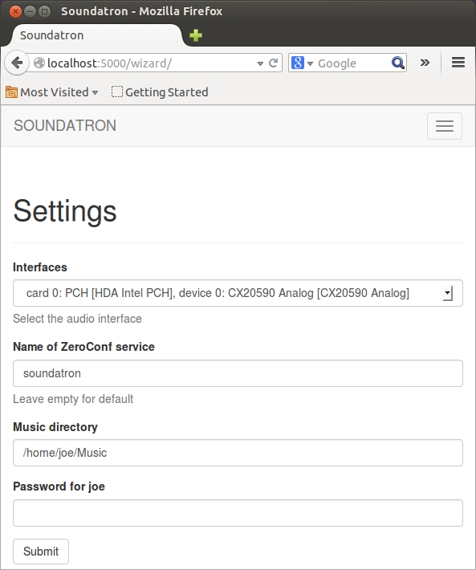

.. Soundatron documentation master file, created by
   sphinx-quickstart on Mon May 19 19:59:44 2014.
   You can adapt this file completely to your liking, but it should at least
   contain the root `toctree` directive.

Welcome to Soundatron's documentation!
======================================

Welcome Soundatron's documentation.

Soundatron is a small flask app that helps you configure your bit perfect MPD server. Soundatron is targeted at little arm computers like the `RaspberyPi <http://www.raspberrypi.org/>`_ and `BeagleBone Black <http://beagleboard.org/Products/BeagleBone%20Black>`_ boards, but will probably run on anything that meets the requirements.

Soundatron has been tested on the following device OS combos:

1. Beaglebone Black - `Debian Wheezy 7.4 <http://beagleboard.org/latest-images>`_
2. Raspberry PI - `Raspian <http://www.raspberrypi.org/downloads/>`_
3. And my laptop, a Lenovo E220s - Ubuntu 13.10

Soundatron works because `mpd-configure <https://github.com/ronalde/mpd-configure>`_ works. Check it out.

Contents:
 
.. toctree::
   :maxdepth: 3

   about.rst
   installation.rst
 
 

Indices and tables
==================
 
* :ref:`genindex`
* :ref:`modindex`
* :ref:`search`